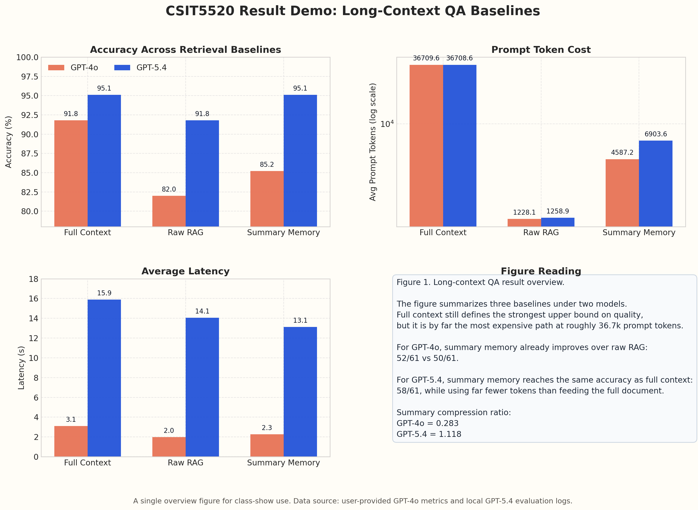

# CSIT5520 Result Demo: Long-Context QA Baselines

## Figure 1. Overview of long-context QA results under GPT-4o and GPT-5.4

The figure summarizes three baselines: `full_context / no-memory`, `raw RAG`, and `summary memory`.
It follows the class-show style of a single figure plus short interpretation rather than splitting the discussion into separate comparison slides.

### Main Reading

- For `GPT-4o`, `summary memory` already outperforms `raw RAG`:
  - `52/61` vs `50/61`
- For `GPT-4o`, `full_context` is still the strongest baseline:
  - `56/61`
- In cost terms:
  - `raw RAG` is the cheapest
  - `summary memory` is in the middle
  - `full_context` is the most expensive, at about `36.7k` prompt tokens

### Additional Observation from GPT-5.4

- `GPT-5.4` improves all three baselines over `GPT-4o`
- The strongest result is that `summary memory` reaches the same accuracy as `full_context`:
  - `58/61`
- This suggests that with a stronger backbone model, structured memory retrieval can close the gap to the full-document upper bound

## Metrics Table

| Model | Method | Accuracy | Hit Rate | Avg Prompt Tokens | Avg Total Tokens | Avg Latency |
| --- | --- | ---: | ---: | ---: | ---: | ---: |
| GPT-4o | Full Context / No-Memory | 91.8% (56/61) | - | 36709.6 | 36729.7 | 3.10s |
| GPT-4o | Raw RAG | 82.0% (50/61) | 85.2% (52/61) | 1228.1 | 1262.6 | 1.97s |
| GPT-4o | Summary Memory | 85.2% (52/61) | 91.8% (56/61) | 4587.2 | 4616.1 | 2.27s |
| GPT-5.4 | Full Context / No-Memory | 95.1% (58/61) | - | 36708.6 | 36725.8 | 15.89s |
| GPT-5.4 | Raw RAG | 91.8% (56/61) | 86.9% (53/61) | 1258.9 | 1287.2 | 14.05s |
| GPT-5.4 | Summary Memory | 95.1% (58/61) | 98.4% (60/61) | 6903.6 | 6923.7 | 13.12s |

## Notes

- `GPT-4o summary memory` compression ratio: `0.283`
- `GPT-5.4 summary memory` compression ratio: `1.118`
- The `GPT-5.4 summary memory` evaluation had `1` timeout during the run
