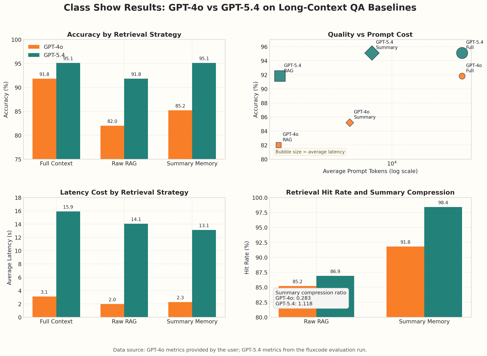

# Results Comparison: GPT-4o vs GPT-5.4

## What The Figure Says

- `GPT-5.4` is stronger on all three baselines in terms of answer quality.
- The largest quality gains show up on `raw RAG` and `summary memory`, not on `full context`.
- `GPT-4o` is much faster in this setup, while `GPT-5.4` pays a large latency premium.
- `summary memory` is the middle point in the cost-quality tradeoff: much cheaper than `full context`, but more expensive than `raw RAG`.

## Headline Metrics

| Model | Method | Accuracy | Hit Rate | Avg Prompt Tokens | Avg Total Tokens | Avg Latency |
| --- | --- | ---: | ---: | ---: | ---: | ---: |
| GPT-4o | Full Context / No-Memory | 91.8% (56/61) | - | 36709.6 | 36729.7 | 3.10s |
| GPT-4o | Raw RAG | 82.0% (50/61) | 85.2% (52/61) | 1228.1 | 1262.6 | 1.97s |
| GPT-4o | Summary Memory | 85.2% (52/61) | 91.8% (56/61) | 4587.2 | 4616.1 | 2.27s |
| GPT-5.4 | Full Context / No-Memory | 95.1% (58/61) | - | 36708.6 | 36725.8 | 15.89s |
| GPT-5.4 | Raw RAG | 91.8% (56/61) | 86.9% (53/61) | 1258.9 | 1287.2 | 14.05s |
| GPT-5.4 | Summary Memory | 95.1% (58/61) | 98.4% (60/61) | 6903.6 | 6923.7 | 13.12s |

## Interpretation

### 1. Full Context is still the upper bound, but only for GPT-4o

- On `GPT-4o`, `full context` remains the best answer-quality baseline: `56/61`.
- On `GPT-5.4`, `summary memory` reaches the same accuracy as `full context`: `58/61`.
- This means the stronger model benefits more from structured long-term memory retrieval.

### 2. Summary Memory consistently beats Raw RAG

- On `GPT-4o`, `summary memory` improves over `raw RAG` from `50/61` to `52/61`.
- On `GPT-5.4`, `summary memory` improves over `raw RAG` from `56/61` to `58/61`.
- The hit-rate gap is even clearer:
  - `GPT-4o`: `91.8%` vs `85.2%`
  - `GPT-5.4`: `98.4%` vs `86.9%`

### 3. The cost-quality tradeoff changes by model

- `Raw RAG` is always the cheapest prompt path.
- `Summary memory` sits in the middle:
  - far cheaper than `full context`
  - but more expensive than `raw RAG`
- `Full context` is always the most expensive path, at roughly `36.7k` prompt tokens per question.

## Practical Reading

### GPT-4o

- If you want the best accuracy, `full context` is still the safest choice.
- If you want a cheaper retrieval baseline, `summary memory` is the better tradeoff than `raw RAG`.
- The key result is that summary-based retrieval improves quality without exploding latency.

### GPT-5.4

- `Summary memory` is the most interesting result here, because it matches `full context` accuracy while using about `81%` fewer prompt tokens.
- `GPT-5.4 raw RAG` is already strong, but `summary memory` pushes quality to the level of `full context`.
- The main downside is latency: in this environment, `GPT-5.4` is much slower than `GPT-4o`.

## Important Caveat

- The `GPT-5.4 summary memory` run had `1` timeout during evaluation.
- Its summary compression ratio is `1.118`, which means the generated memories are currently too verbose.
- So the retrieval logic is working well, but the memory representation itself still has room to be compressed.

## Takeaway

- If the goal is **highest quality at any cost**, `full context` remains a strong baseline.
- If the goal is **best efficiency**, `raw RAG` is still the cheapest option.
- If the goal is **balanced quality and cost**, `summary memory` is the most promising direction, especially with a stronger backbone model.
