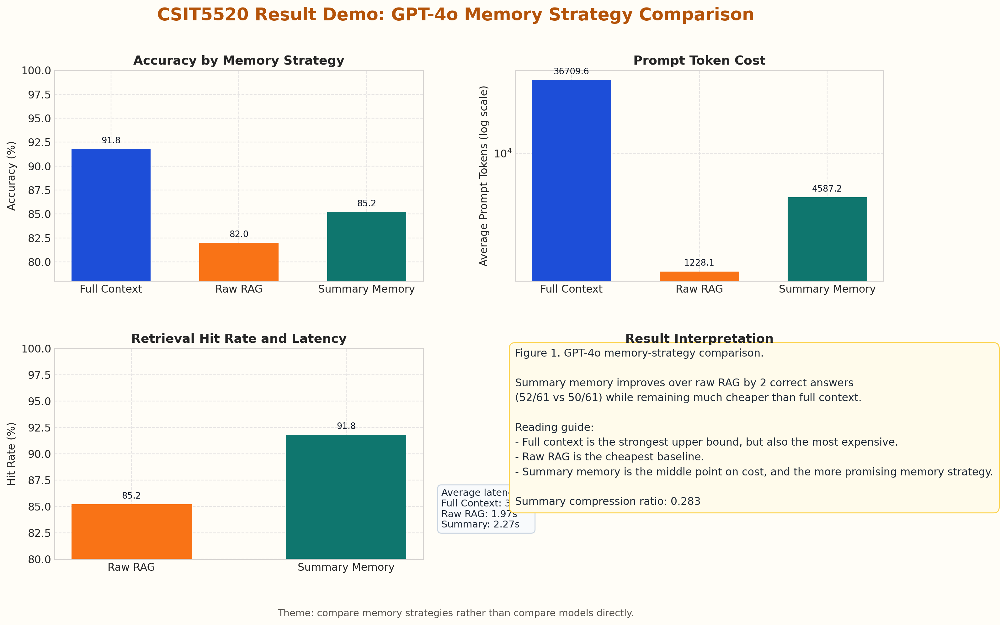
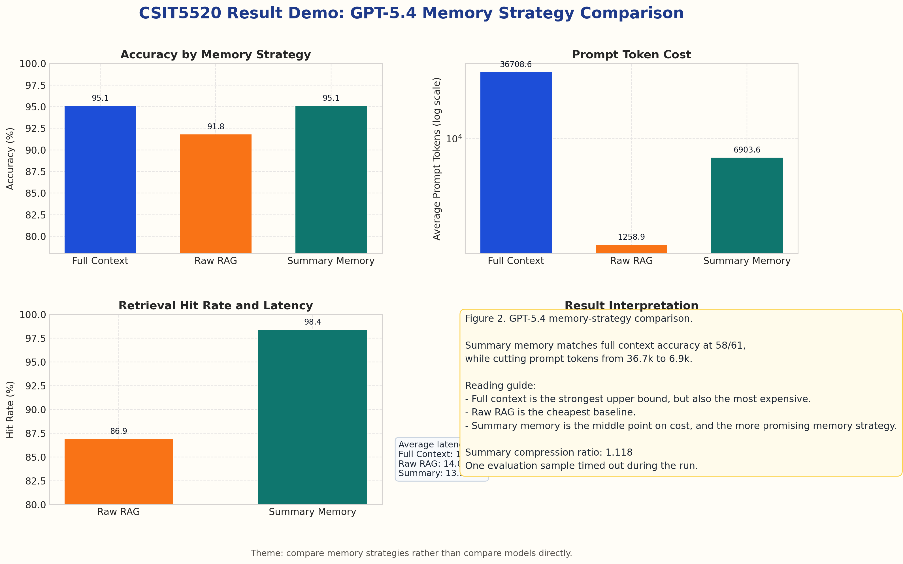

# CSIT5520 Result Demo: Comparing Memory Strategies

## Figure 1. GPT-4o memory strategy comparison

Under `GPT-4o`, the key comparison is between `raw RAG` and `summary memory`, because both are retrieval-style memory baselines.

- `summary memory` improves over `raw RAG` in both quality and retrieval:
  - Accuracy: `85.2% (52/61)` vs `82.0% (50/61)`
  - Hit Rate: `91.8% (56/61)` vs `85.2% (52/61)`
- `full_context / no-memory` is still the strongest upper bound:
  - Accuracy: `91.8% (56/61)`
- Cost tradeoff:
  - `raw RAG` is the cheapest at `1228.1` prompt tokens
  - `summary memory` is in the middle at `4587.2`
  - `full_context` is the most expensive at `36709.6`

So for `GPT-4o`, the summary-based memory design is already a better retrieval baseline than raw chunk retrieval, even though it does not yet surpass the full-document upper bound.

## Figure 2. GPT-5.4 memory strategy comparison

Under `GPT-5.4`, the strongest result is that `summary memory` reaches the same answer accuracy as `full_context`.

- `summary memory` vs `raw RAG`:
  - Accuracy: `95.1% (58/61)` vs `91.8% (56/61)`
  - Hit Rate: `98.4% (60/61)` vs `86.9% (53/61)`
- `summary memory` vs `full_context`:
  - Same accuracy: `58/61`
  - Much lower prompt cost: `6903.6` vs `36708.6`
- Latency in this run:
  - `summary memory`: `13.12s`
  - `raw RAG`: `14.05s`
  - `full_context`: `15.89s`

This is the clearest evidence that a stronger backbone model can make structured memory retrieval competitive with the full-context upper bound.

## Metrics Table

| Model | Method | Accuracy | Hit Rate | Avg Prompt Tokens | Avg Total Tokens | Avg Latency |
| --- | --- | ---: | ---: | ---: | ---: | ---: |
| GPT-4o | Full Context / No-Memory | 91.8% (56/61) | - | 36709.6 | 36729.7 | 3.10s |
| GPT-4o | Raw RAG | 82.0% (50/61) | 85.2% (52/61) | 1228.1 | 1262.6 | 1.97s |
| GPT-4o | Summary Memory | 85.2% (52/61) | 91.8% (56/61) | 4587.2 | 4616.1 | 2.27s |
| GPT-5.4 | Full Context / No-Memory | 95.1% (58/61) | - | 36708.6 | 36725.8 | 15.89s |
| GPT-5.4 | Raw RAG | 91.8% (56/61) | 86.9% (53/61) | 1258.9 | 1287.2 | 14.05s |
| GPT-5.4 | Summary Memory | 95.1% (58/61) | 98.4% (60/61) | 6903.6 | 6923.7 | 13.12s |

## Takeaway

- The topic is not model-vs-model comparison by itself.
- The real theme is how different memory strategies behave under each model.
- In both models, `summary memory` is better than `raw RAG`.
- In `GPT-5.4`, `summary memory` becomes especially strong because it matches `full_context` accuracy while using far fewer prompt tokens.
