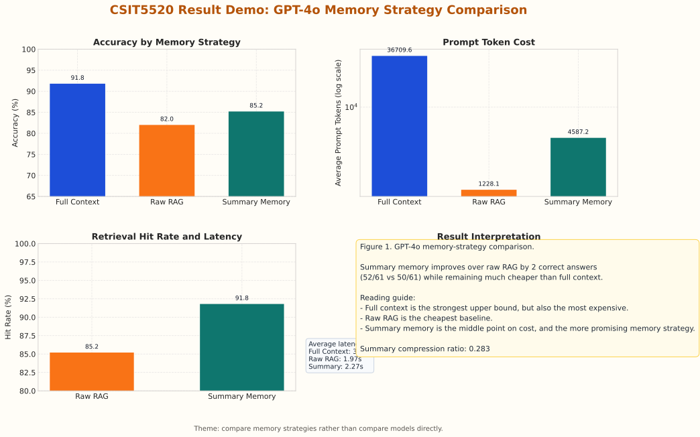
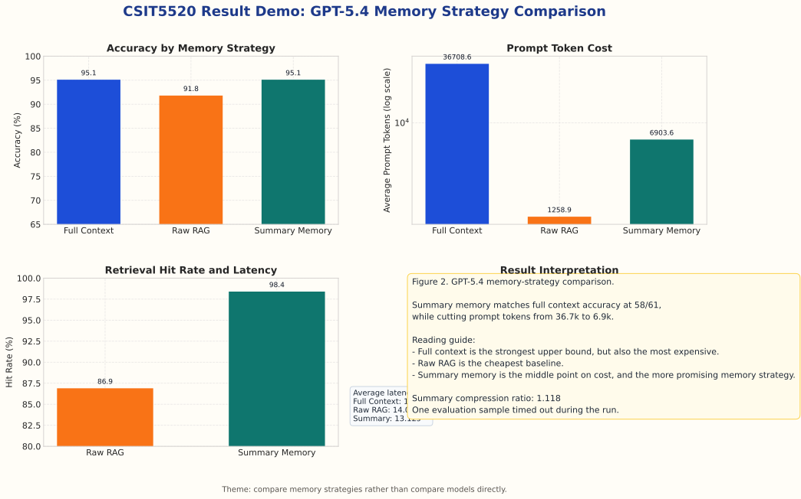
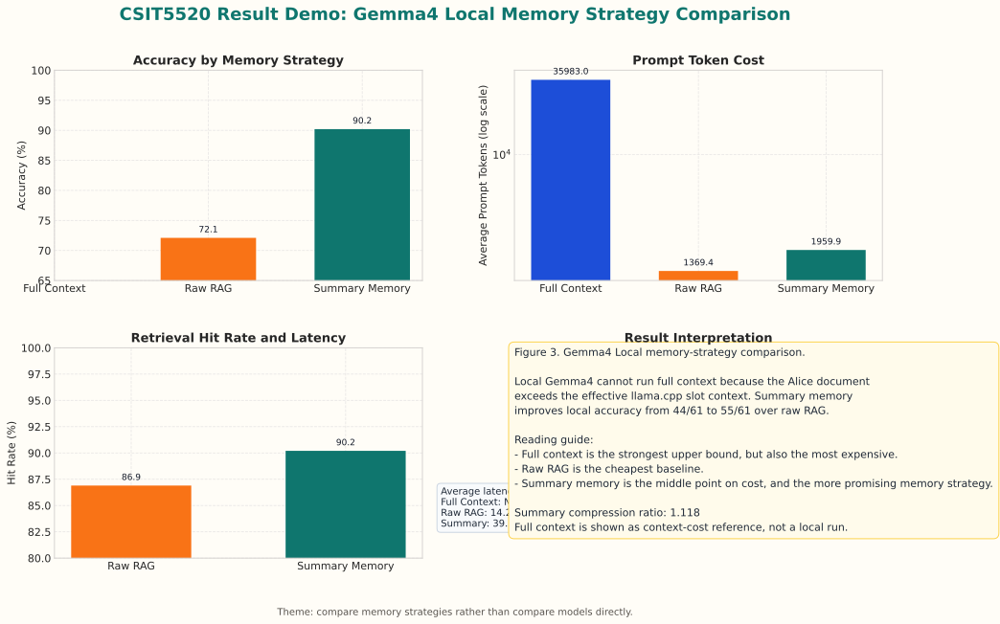
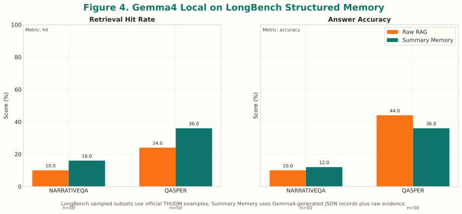

# Technical Report: Structured Summary Memory for Long-Context Question Answering

## Abstract

This project studies whether structured memory can improve the quality-cost tradeoff of long-context question answering. We compare three memory strategies: full-context prompting, raw chunk retrieval-augmented generation (Raw RAG), and Structured Summary Memory. The initial AliceQA-61 evaluation is treated as a controlled pilot case study rather than a large-scale benchmark. To make the evaluation more robust, we also run sampled standard long-context QA experiments on LongBench `narrativeqa` and `qasper`.

The main finding is that Structured Summary Memory improves evidence retrieval over Raw RAG. On AliceQA-61 with a local Gemma 30B-class model served by llama.cpp, Summary Memory reaches 90.2% answer accuracy, compared with 72.1% for Raw RAG. In retrieval-only evaluation, Summary Memory retrieves answer-relevant context for 61 out of 61 AliceQA questions, while Raw RAG retrieves relevant context for 53 out of 61. On sampled LongBench subsets, structured memory also improves retrieval hit rate, although generation results are mixed because the local model has limited context capacity and is sensitive to longer retrieved contexts.

## 1. Introduction

Long-context question answering can be implemented by directly placing the full document into the model prompt. This full-context strategy is simple and often strong, but it creates high active-context cost and may be slow or infeasible for local models. Raw RAG reduces context size by retrieving only a few chunks, but fixed-size chunks can miss answer-relevant details when information is distributed across scenes or sections.

Structured Summary Memory is designed as a middle path. Instead of indexing only raw text chunks, the document is first converted into structured memory records. Each record stores a concise section summary, key entities, key events, exact facts, and supporting quotes. At query time, the system retrieves relevant memory records and then adds raw evidence back into the prompt. The goal is not to replace the source text with summaries, but to use structured memory to locate better evidence with lower active-context cost than full-context prompting.

The report addresses three research questions:

1. Does Structured Summary Memory retrieve answer-relevant evidence more reliably than Raw RAG?
2. Does it reduce active context compared with full-context prompting?
3. Under the same local model, does structured memory improve answer quality or quality-cost tradeoff on both controlled and standard long-context QA settings?

## 2. Data

### 2.1 AliceQA-61

AliceQA-61 is a manually curated controlled case study based on *Alice in Wonderland*. Each example contains a detail-oriented question, a list of expected answer keywords, and a short description of the tested detail. The questions cover named objects, locations, numbers, labels, quoted phrases, event order, and character-specific details.

This dataset is useful for debugging and controlled comparison because the document, questions, and evaluation keywords are fixed. However, it is small and manually constructed, so it should not be interpreted as a broad benchmark result.

### 2.2 LongBench Sampled Subsets

To test whether the method transfers beyond the project-specific AliceQA setting, we use sampled subsets from the official THUDM LongBench archive. The two selected subsets are:

| Dataset | Sample Size | Motivation |
| --- | ---: | --- |
| LongBench `narrativeqa` | 50 retrieval / 50 generation | Long narrative QA, closest to the AliceQA story setting |
| LongBench `qasper` | 50 retrieval / 50 generation | Scientific-paper QA, used to test a non-narrative document style |

The sampled examples are stored under `data/longbench/`. Each example contains a long context, a question, one or more reference answers, and an example identifier.

## 3. Methods

### 3.1 Full-Context Prompting

Full-context prompting places the whole source document into the prompt. It is used as an upper-bound reference in the AliceQA experiments. In the local LongBench experiments, we focus on retrieval-based methods because the local Gemma model served by llama.cpp has a practical context limit that makes full-document prompting infeasible for many examples.

### 3.2 Raw RAG

The Raw RAG baseline splits each document into fixed-size chunks and embeds each chunk with the local `all-MiniLM-L6-v2` sentence-transformer model. The project uses a lightweight local vector store rather than a heavy RAG framework. Text and metadata are stored in `records.json`, and vectors are stored in `embeddings.npy`. At query time, the question is embedded with the same local model, cosine similarity is computed against all chunk vectors, and the top retrieved chunks are inserted into the prompt.

This design keeps the retrieval layer minimal and reduces framework-level variables such as loader behavior, index configuration, metadata filtering, and default prompt templates.

### 3.3 Structured Summary Memory

Structured Summary Memory builds a reusable memory layer before answering questions. The construction pipeline is:

1. Split the long document into larger sections.
2. Use the local Gemma model to summarize each section into a structured JSON memory record.
3. Store fields such as `section_summary`, `key_entities`, `key_events`, `exact_facts`, and `supporting_quotes`.
4. Format the JSON record into retrievable text.
5. Embed the formatted memory records with `all-MiniLM-L6-v2`.
6. Build a local summary-memory vector index.
7. At query time, retrieve relevant memory records and add supporting raw excerpts.
8. Generate the final answer using the same model and decoding settings as Raw RAG.

This method has a one-time preprocessing cost because each section must be summarized once. After construction, the memory records are cached and reused across questions. This is different from simply calling a summarization API for every query; the memory layer is built once, indexed, and reused.

## 4. Experimental Setup

### 4.1 Local Generation Model

For the local experiments, we use a Gemma 30B-class instruction model served locally with llama.cpp. The model is exposed through an OpenAI-compatible local interface, but the report treats it simply as a local Gemma model rather than a remote API. The GGUF checkpoint used in the experiments is a quantized Gemma-4-31B-IT variant. Decoding uses deterministic settings with temperature 0.0. The local setup has a practical context budget of roughly 2,000 prompt tokens in the evaluation client, so retrieved context must be packed carefully.

### 4.2 Metrics

We report both retrieval and generation metrics:

- **Retrieval hit rate**: whether the retrieved context contains expected answer evidence.
- **Answer accuracy**: whether the generated answer matches the expected keyword or reference-answer criterion.
- **Average context size**: approximate number of characters or tokens placed into the prompt.
- **Latency**: retrieval time or local generation time.

For AliceQA, keyword matching is used because each question has manually defined expected answer keywords. For LongBench, the automatic score is based on the available sampled reference answers, so paraphrased correct answers may be under-counted.

## 5. Results

### 5.1 Previous Strong-Model AliceQA Results

The earlier remote-model experiments are useful as a reference because they compare Full Context, Raw RAG, and Summary Memory on the same 61 AliceQA questions.





| Model | Method | Accuracy | Hit Rate | Avg Prompt Tokens | Avg Total Tokens | Avg Latency |
| --- | --- | ---: | ---: | ---: | ---: | ---: |
| GPT-4o | Full Context | 91.8% (56/61) | - | 36,709.6 | 36,729.7 | 3.10s |
| GPT-4o | Raw RAG | 82.0% (50/61) | 85.2% (52/61) | 1,228.1 | 1,262.6 | 1.97s |
| GPT-4o | Summary Memory | 85.2% (52/61) | 91.8% (56/61) | 4,587.2 | 4,616.1 | 2.27s |
| GPT-5.4 | Full Context | 95.1% (58/61) | - | 36,708.6 | 36,725.8 | 15.89s |
| GPT-5.4 | Raw RAG | 91.8% (56/61) | 86.9% (53/61) | 1,258.9 | 1,287.2 | 14.05s |
| GPT-5.4 | Summary Memory | 95.1% (58/61) | 98.4% (60/61) | 6,903.6 | 6,923.7 | 13.12s |

Under GPT-5.4, Summary Memory reaches the same 95.1% accuracy as Full Context while reducing average prompt tokens from 36,708.6 to 6,903.6. This suggests that structured memory can approach full-context quality when retrieval is reliable and the answering model is strong enough to use the compact evidence.

### 5.2 AliceQA Retrieval-Only Evaluation

| Method | Hit Rate | Hits | Avg Context Chars | Avg Retrieval Latency |
| --- | ---: | ---: | ---: | ---: |
| Raw RAG | 86.9% | 53/61 | 5,997.4 | 0.035s |
| Summary Memory | 100.0% | 61/61 | 27,788.0 | 0.022s |
| Full Context | N/A | N/A | 143,932.0 | N/A |

Summary Memory retrieves answer-relevant evidence for all AliceQA questions. The tradeoff is that it retrieves longer context because it combines structured memory with supporting raw excerpts.

### 5.3 AliceQA Local Gemma Generation



| Method | Accuracy | Retrieval Hit | Avg Context Tokens | Avg Total Tokens | Avg Generation Latency |
| --- | ---: | ---: | ---: | ---: | ---: |
| Raw RAG | 72.1% | 86.9% | 1,199.0 | 1,382.8 | 14.25s |
| Summary Memory | 90.2% | 90.2% | 1,999.8 | 2,022.0 | 39.74s |

With the same local Gemma model, Summary Memory answers 55 out of 61 questions correctly, compared with 44 out of 61 for Raw RAG. The improvement is substantial, but the method is slower because it uses longer active context.

### 5.4 LongBench Retrieval-Only Evaluation

| Dataset | Method | Hit Rate | Hits | Avg Context Chars | Avg Retrieval Latency |
| --- | --- | ---: | ---: | ---: | ---: |
| narrativeqa-50 | Raw RAG | 10.0% | 5/50 | 4,786.5 | 0.436s |
| narrativeqa-50 | Summary Memory | 16.0% | 8/50 | 34,640.4 | 0.493s |
| qasper-50 | Raw RAG | 24.0% | 12/50 | 4,752.5 | 0.078s |
| qasper-50 | Summary Memory | 36.0% | 18/50 | 29,078.3 | 0.099s |

Structured memory improves retrieval hit rate on both sampled standard datasets. NarrativeQA improves from 5 to 8 hits out of 50, while Qasper improves from 12 to 18 hits out of 50. This supports the claim that structured memory can expose answer-relevant evidence more effectively than raw chunk retrieval.

### 5.5 LongBench Local Gemma Generation



| Dataset | Method | Accuracy | Correct | Avg Answer Score | Avg Generation Latency |
| --- | --- | ---: | ---: | ---: | ---: |
| narrativeqa-50 | Raw RAG | 10.0% | 5/50 | 0.126 | 6.72s |
| narrativeqa-50 | Summary Memory | 12.0% | 6/50 | 0.163 | 9.32s |
| qasper-50 | Raw RAG | 44.0% | 22/50 | 0.404 | 7.24s |
| qasper-50 | Summary Memory | 36.0% | 18/50 | 0.356 | 10.08s |

The generation results are mixed. On NarrativeQA, Summary Memory provides a small improvement. On Qasper, Summary Memory retrieves more relevant evidence but produces lower final answer accuracy. This indicates that retrieval quality and final generation quality are related but not identical. Longer structured context can increase evidence coverage while also introducing more material for the local model to select from.

## 6. Discussion

The AliceQA results support the main hypothesis: structured memory improves evidence retrieval and can improve answer accuracy under the same local generation model. The method is especially useful when questions repeatedly target the same document, because the memory construction cost is paid once and the memory index is reused.

The LongBench results are more conservative but more informative. Structured memory improves retrieval hit rate on both sampled subsets, which suggests that the representation is useful beyond the manually curated AliceQA case study. However, the local generation results show that better retrieval does not automatically guarantee better answers. For Qasper, the local model may struggle with longer structured contexts or with scientific QA paraphrases.

These results suggest that the next improvement should focus on context packing and evidence reranking. Summary Memory should retrieve enough structured evidence to locate the answer, but the final prompt should be compact enough for the local model to answer reliably.

## 7. Limitations

Several limitations should be considered:

- AliceQA-61 is small and manually curated, so it is best interpreted as a controlled case study.
- LongBench experiments use sampled subsets rather than the full benchmark.
- Structured memory has a one-time preprocessing cost. In the LongBench run, 719 section records were generated locally.
- Full Context can benefit from prompt caching or KV cache, so token cost is not the only factor; active context size and latency also matter.
- Automatic keyword or reference matching can misjudge paraphrased answers.
- The local Gemma model has a limited effective context budget, which makes evidence packing important.

## 8. Reproducibility

The main commands used for reproduction are:

```bash
pixi run test
pixi run retrieval-eval
pixi run local-gemma4-eval
pixi run download-longbench
pixi run build-longbench-structured-memory
pixi run longbench-structured-retrieval-eval
pixi run longbench-structured-gemma4-eval
```

The main result files are:

- `results/aliceqa_retrieval_only.json`
- `results/local_generation_gemma4_aliceqa.json`
- `results/longbench_retrieval_only.json`
- `results/local_generation_gemma4_longbench.json`
- `results/tables/*.csv`

## 9. Conclusion

Structured Summary Memory provides a promising quality-cost tradeoff for long-context question answering. In the controlled AliceQA case study, it improves local Gemma answer accuracy from 72.1% to 90.2% compared with Raw RAG, and it improves retrieval-only hit rate from 86.9% to 100.0%. On sampled LongBench subsets, it consistently improves retrieval hit rate, although generation results depend on the dataset and the local model's ability to use longer structured context.

Overall, the project shows that structured memory can improve evidence localization, but it also reveals a practical bottleneck: retrieved memory must be carefully packed and reranked so that local models can use it effectively.
