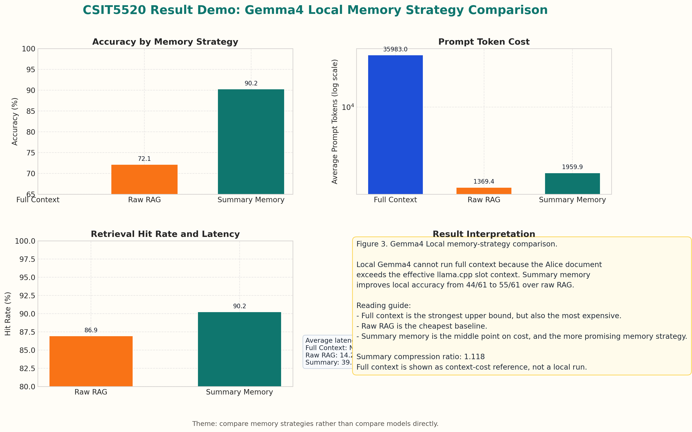
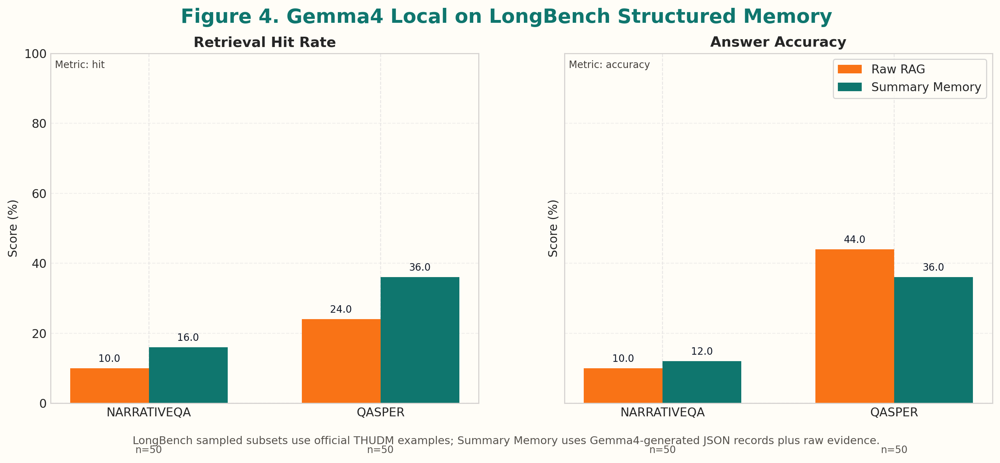

# Structured Summary Memory for Long-Context QA

## 摘要

本项目研究 Structured Summary Memory 是否能改善长文本问答中的质量-成本折中。AliceQA-61 定位为 controlled pilot case study；为了增加可信度，又加入 LongBench `narrativeqa` 和 `qasper` sampled subsets，并使用本地 Gemma4 GGUF 服务做低成本生成实验。

核心结论：在 AliceQA-61 上，Summary Memory 的本地 Gemma4 准确率为 `90.2% (55/61)`，高于 Raw RAG 的 `72.1% (44/61)`。Retrieval-only 评测中，Summary Memory 命中 `61/61`，Raw RAG 命中 `53/61`。这说明结构化记忆更容易把答案证据带入上下文，但代价是更长的 active context 和更高延迟。

## 实验设置

### 数据集

| Dataset | Size | Purpose |
| --- | ---: | --- |
| AliceQA-61 | 61 | 手工构造的《Alice in Wonderland》细节问答，用于 controlled case study |
| LongBench narrativeqa | 50 retrieval / 50 generation | 标准长故事 QA sampled subset |
| LongBench qasper | 50 retrieval / 50 generation | 标准论文 QA sampled subset |

LongBench 样本来自官方 THUDM LongBench Hugging Face archive:

`https://huggingface.co/datasets/THUDM/LongBench/resolve/main/data.zip`

### 模型和服务

本地生成模型：

- Service: `http://127.0.0.1:8012/v1`
- Model name: `gemma4-31b-gguf`
- Checkpoint: `user2602/gemma-4-31b-it-abliterated-GGUF / gemma-4-31b-it-abliterated-t126-Q4_K_M.gguf`
- Serving backend: llama.cpp OpenAI-compatible server
- 本次实验观测进程: PID `3146993`, PPID `1`
- Server command includes: `-c 16384 -np 4 -ngl 999 --jinja --port 8012`
- Prompt context budget in evaluation client: `8000` chars, approximate `2000` tokens
- Decoding: `temperature=0.0`, `max_tokens=128` for AliceQA, `max_tokens=96` for LongBench

Gemma4/llama.cpp 的短分类请求会把 token 消耗在 `reasoning_content`，导致 `message.content` 为空。本项目在 `nlp_baselines/local_generation.py` 中固定传入:

```json
{"chat_template_kwargs": {"enable_thinking": false}}
```

并禁用环境代理，确保本地 `127.0.0.1:8012` 请求不会被错误转发到代理端口。

## 方法

### Structured Memory Construction

Structured Summary Memory 使用一条可缓存的 memory construction pipeline：

1. **Section split**: 将长文档切成较大的 section。AliceQA 使用已缓存的 `summary_cache/alice_section_summaries.jsonl`；LongBench structured run 使用约 `10000` characters section 和 `500` characters overlap，以适配本地 Gemma4 的实际 `4096` token slot。
2. **LLM structured summarization**: 对每个 section 调用本地 Gemma4，生成 JSON memory record。
3. **JSON schema**: 每条 memory 包含：
   - `section_summary`: 该 section 的 2-4 句摘要。
   - `key_entities`: 人物、地点、系统、数据集、论文对象等。
   - `key_events`: 关键事件、论点、实验发现或剧情动作。
   - `exact_facts`: 可直接回答问题的事实，包括数字、标签、名字、因果关系。
   - `supporting_quotes`: 可作为证据的短原文片段。
4. **Memory formatting**: 将 JSON record 格式化为可检索文本。
5. **Memory index**: 使用本地 `all-MiniLM-L6-v2` embedding 和 `LocalVectorStore` 建 summary memory vector index。
6. **Query-time retrieval**: 查询时先检索 structured memory，再根据命中的 section 补回 raw evidence chunks。
7. **Answer generation**: Raw RAG 和 Summary Memory 使用同一个本地 Gemma4、相同 decoding 参数，保证比较公平。

LongBench structured memory 缓存在 `data/longbench/structured_memory/`，每个 example 一个 JSONL 文件。缓存是断点式写入；如果中途中断，下一次会跳过已完成 sections。

Gemma4 本地服务有一个重要细节：短分类或 JSON 生成如果没有关闭 thinking，可能把 token 消耗在 `reasoning_content`，导致 `message.content` 为空。本项目在本地 wrapper 中统一传入：

```json
{"chat_template_kwargs": {"enable_thinking": false}}
```

这也是 NLI/短输出空结果问题的修复点。

### Full Context

Full Context 将整篇文档放入 prompt。它在 AliceQA 中作为 upper-bound reference，但没有在 LongBench 本地生成中全量使用，因为本地服务的 per-slot context 实际限制为 `4096` tokens。

### Raw RAG

Raw RAG 将文档切成 fixed-size chunks，使用 `all-MiniLM-L6-v2` 生成本地 embedding，并用轻量 `LocalVectorStore` 做 cosine similarity 检索。

### Structured Summary Memory

AliceQA 的 Summary Memory 使用已缓存的结构化 section summaries，每条 memory 包含 summary、entities、events、exact facts 和 supporting quotes。查询时先检索 summary memory，再补回 raw chunks 作为证据。

LongBench 部分使用真正的 LLM-generated structured memory：对每篇标准数据集文档按 section 调用本地 Gemma4 生成 JSON memory，再建立 summary memory index。

## Dataset Construction and Standard Benchmark Setup

### AliceQA-61

AliceQA-61 是项目内部构造的 controlled case study，基于 `data/books/alice_in_wonderland.md`。每个 testcase 包含：

- `query`: 细节型问题。
- `expected_in_answer`: 判断答案是否正确的关键词。
- `description`: 问题覆盖的细节点。

这些问题覆盖人物、物品、数字、标签、台词、事件顺序和双关等长文本细节。它的优点是可控、适合 debug retrieval；局限是规模小、手工构造，不能称为大规模 benchmark。

### LongBench Sampled Subsets

标准数据集使用 THUDM LongBench 官方 Hugging Face archive：

```text
https://huggingface.co/datasets/THUDM/LongBench/resolve/main/data.zip
```

下载脚本 `nlp_baselines/download_longbench_samples.py` 将样本写入：

- `data/longbench/narrativeqa_sample.jsonl`
- `data/longbench/qasper_sample.jsonl`

每条 LongBench example 包含：

- `context`: 长文档。
- `input`: 问题。
- `answers`: 标准答案列表。
- `_id`: example id。

本报告使用：

- `narrativeqa`: 50 条 retrieval-only，50 条 local generation。
- `qasper`: 50 条 retrieval-only，50 条 local generation。

选择原因：

- `narrativeqa` 接近 AliceQA 的长故事问答场景。
- `qasper` 是论文问答，用于测试方法是否只适用于 narrative text。

## PPT Main Results From Previous Runs

PPT 中已有远程模型主结果，这些是本项目最清楚的 memory strategy comparison：


| Model | Method | Accuracy | Hit Rate | Avg Prompt Tokens | Avg Total Tokens | Avg Latency |
| --- | --- | ---: | ---: | ---: | ---: | ---: |
| GPT-4o | Full Context / No-Memory | 91.8% (56/61) | - | 36709.6 | 36729.7 | 3.10s |
| GPT-4o | Raw RAG | 82.0% (50/61) | 85.2% (52/61) | 1228.1 | 1262.6 | 1.97s |
| GPT-4o | Summary Memory | 85.2% (52/61) | 91.8% (56/61) | 4587.2 | 4616.1 | 2.27s |
| GPT-5.4 | Full Context / No-Memory | 95.1% (58/61) | - | 36708.6 | 36725.8 | 15.89s |
| GPT-5.4 | Raw RAG | 91.8% (56/61) | 86.9% (53/61) | 1258.9 | 1287.2 | 14.05s |
| GPT-5.4 | Summary Memory | 95.1% (58/61) | 98.4% (60/61) | 6903.6 | 6923.7 | 13.12s |

这个结果说明：Summary Memory 在两个远程模型上都优于 Raw RAG；在 GPT-5.4 上，它达到 Full Context 同等准确率，同时将 prompt tokens 从 `36708.6` 降到 `6903.6`。

## 结果 1: AliceQA Retrieval-Only

| Method | Hit Rate | Hits | Avg Context Chars | Avg Retrieval Latency |
| --- | ---: | ---: | ---: | ---: |
| Raw RAG | 86.9% | 53/61 | 5997.4 | 0.035s |
| Summary Memory | 100.0% | 61/61 | 27788.0 | 0.022s |
| Full Context | N/A | N/A | 143932.0 | N/A |

Interpretation: Summary Memory 在 AliceQA 上检索命中所有问题，说明结构化 memory 对细节证据定位有效。但它检索出的 summary + support context 更长，因此后续生成时需要 context budget 控制。

## 结果 2: AliceQA Local Gemma4 Generation



| Method | Accuracy | Retrieval Hit | Avg Context Tokens | Avg Total Tokens | Avg Generation Latency |
| --- | ---: | ---: | ---: | ---: | ---: |
| Raw RAG | 72.1% | 86.9% | 1199.0 | 1382.8 | 14.25s |
| Summary Memory | 90.2% | 90.2% | 1999.8 | 2022.0 | 39.74s |

Interpretation: 在同一个本地 Gemma4 模型下，Summary Memory 比 Raw RAG 多答对 `11` 题。它也显著更慢，因为 context 更长，且 Gemma4 本地服务生成速度有限。

## 结果 2.5: Full Context Baseline

Full Context / No-Memory 是最直接的 baseline：把 Alice 全文直接放入 prompt。已有历史实验结果如下：

| Model | Method | Accuracy | Avg Prompt Tokens | Avg Total Tokens | Avg Latency |
| --- | --- | ---: | ---: | ---: | ---: |
| GPT-4o | Full Context / No-Memory | 91.8% (56/61) | 36709.6 | 36729.7 | 3.10s |
| GPT-5.4 | Full Context / No-Memory | 95.1% (58/61) | 36708.6 | 36725.8 | 15.89s |

对比 GPT-5.4 历史实验，Summary Memory 达到和 Full Context 相同的 `95.1% (58/61)`，但平均 prompt tokens 从 `36708.6` 降到 `6903.6`。这说明在强模型下，Structured Summary Memory 可以接近全输入质量，同时显著减少 active context。

本地 Gemma4 没有跑 Full Context generation。原因是 Alice 全文约 `143932` characters，粗略估算约 `35983` tokens；当前 llama.cpp 服务虽然启动参数包含 `-c 16384`，但实际请求报错显示每个 slot 的 `n_ctx=4096`。因此本地 Gemma4 无法直接承载 Alice 全文输入，报告中只把 Full Context 作为远程模型历史 upper-bound 和 context-cost reference。

## 结果 3: LongBench Retrieval-Only

| Dataset | Method | Hit Rate | Hits | Avg Context Chars | Avg Retrieval Latency |
| --- | --- | ---: | ---: | ---: | ---: |
| narrativeqa-50 | Raw RAG | 10.0% | 5/50 | 4786.5 | 0.436s |
| narrativeqa-50 | Summary Memory (structured) | 16.0% | 8/50 | 34640.4 | 0.493s |
| qasper-50 | Raw RAG | 24.0% | 12/50 | 4752.5 | 0.078s |
| qasper-50 | Summary Memory (structured) | 36.0% | 18/50 | 29078.3 | 0.099s |

Interpretation: true structured memory 在两个标准数据集 sampled subsets 上都提升 retrieval hit。NarrativeQA 从 `5/50` 提升到 `8/50`，Qasper 从 `12/50` 提升到 `18/50`。代价是 retrieved context 明显变长，因为方法会同时带入 structured memory 和原文 evidence sections。

## 结果 4: LongBench Local Gemma4 Generation



| Dataset | Method | Accuracy | Correct | Avg Answer Score | Avg Generation Latency |
| --- | --- | ---: | ---: | ---: | ---: |
| narrativeqa-50 | Raw RAG | 10.0% | 5/50 | 0.126 | 6.72s |
| narrativeqa-50 | Summary Memory (structured) | 12.0% | 6/50 | 0.163 | 9.32s |
| qasper-50 | Raw RAG | 44.0% | 22/50 | 0.404 | 7.24s |
| qasper-50 | Summary Memory (structured) | 36.0% | 18/50 | 0.356 | 10.08s |

Interpretation: generation 结果是 mixed。NarrativeQA 上 Summary Memory 从 `5/50` 小幅提升到 `6/50`；Qasper 上 Summary Memory retrieval 更强，但最终 answer accuracy 从 `22/50` 降到 `18/50`。这说明本地 Gemma4 在论文 QA 上面对更长 structured context 时，答案生成阶段可能引入额外噪声或选择了不匹配标准答案的表述。

## 讨论

AliceQA 结果支持主要假设：Structured Summary Memory 能提升 answer-relevant evidence retrieval，并在本地 Gemma4 下显著提升答案准确率。该方法由结构化记忆定位和原文证据补充组成。

LongBench 结果更谨慎。标准数据集上，true structured memory 稳定提升 retrieval hit，但 generation 收益依赖数据集和本地模型能力。主要原因包括：

- LongBench 本次已经使用本地 Gemma4 生成 structured memory，共 `719` 个 section records，其中 NarrativeQA `559` 条、Qasper `160` 条。
- LongBench 答案更偏 paraphrase，keyword/F1 自动评测会低估语义正确性。
- 本地 Gemma4 服务的 effective context 约 4096 tokens，长文档证据容易被截断。
- Summary Memory 的 retrieved context 更长。它提升 evidence coverage 的同时，也提高了本地模型在 answer selection 阶段处理噪声的难度。
- Qasper retrieval 从 `12/50` 提升到 `18/50`，但 generation 从 `22/50` 降到 `18/50`，说明检索命中和最终答案质量之间仍存在生成模型瓶颈。

## 局限

- AliceQA-61 是小规模手工数据集，不能代表大规模 benchmark。
- LongBench 目前使用 sampled subsets，规模小于 full benchmark。
- Summary Memory 的 AliceQA summary cache 是一次性预处理结果；预处理成本没有计入 per-query online latency。
- Full Context 可以受益于 prompt cache/KV cache；本报告只比较 active context size 和实际本地生成表现。
- LongBench 的 structured memory 预处理成本很高：719 个 section 的平均本地 Gemma4 summarization latency 为 `73.81s`，最大 `118.34s`。
- 自动 accuracy 使用 keyword/substr/F1 规则，不能完全替代人工评估或官方任务评测脚本。

## 复现实验命令

```bash
pixi run test
pixi run retrieval-eval
pixi run local-gemma4-eval
pixi run download-longbench
pixi run build-longbench-structured-memory
pixi run longbench-structured-retrieval-eval
pixi run longbench-structured-gemma4-eval
```

主要结果文件：

- `results/aliceqa_retrieval_only.json`
- `results/local_generation_gemma4_aliceqa.json`
- `results/longbench_retrieval_only.json`
- `results/local_generation_gemma4_longbench.json`
- `results/tables/*.csv`

## 结论

Structured Summary Memory 在 AliceQA controlled case study 中明显优于 Raw RAG：本地 Gemma4 accuracy 从 `72.1%` 提升到 `90.2%`，retrieval-only hit rate 从 `86.9%` 提升到 `100.0%`。这说明结构化长期记忆能改善长文本问答的证据定位和质量-成本折中。

标准数据集 sample 的结果更保守但更可信：LongBench 已经使用本地 Gemma4 生成 true structured memory。Retrieval-only 上，NarrativeQA 从 `10.0%` 提升到 `16.0%`，Qasper 从 `24.0%` 提升到 `36.0%`。Generation 上，NarrativeQA 从 `10.0%` 小幅提升到 `12.0%`，Qasper 从 `44.0%` 降到 `36.0%`。下一步应重点改进 context packing、evidence reranking 和答案生成阶段的噪声控制。
